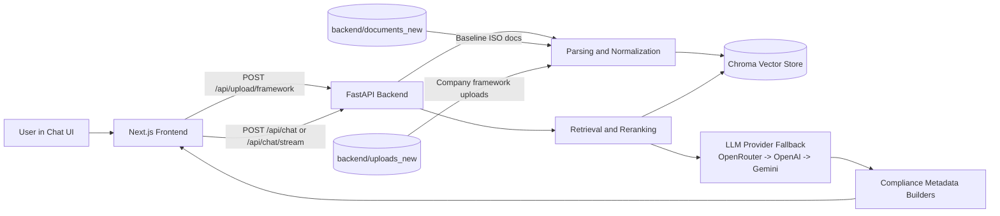
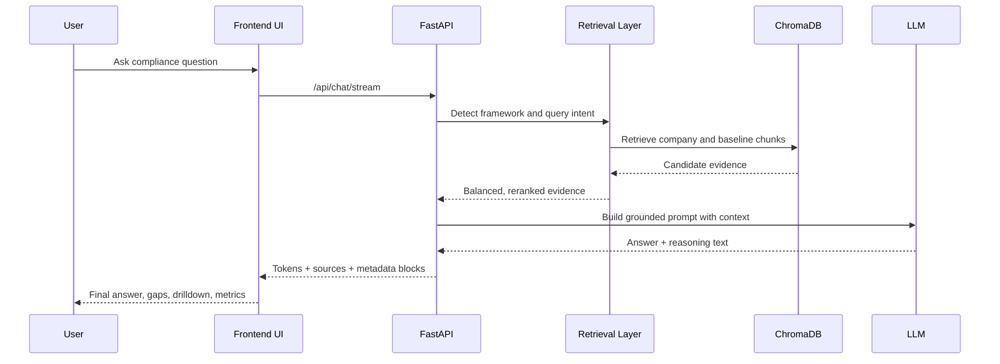

# Arth-Mitra

Arth-Mitra is an AI-powered ISO compliance copilot that compares company policy documents against original ISO standards and produces clause-level findings, evidence traceability, and remediation actions.

## Problem This Solves

Compliance teams spend significant time manually mapping company documents to ISO requirements. This project reduces that effort by providing:
- side-by-side company vs ISO comparison,
- gap-focused findings with citations,
- structured action plans for remediation.

## Scope

Current frameworks supported:
- ISO 37001 (Anti-bribery Management)
- ISO 37301 (Compliance Management)
- ISO 37000 (Governance of Organizations)
- ISO 37002 (Whistleblowing Management)

## Architecture Diagram



## Processing Workflow



## Key Features

- 4 framework upload slots (one company file per framework)
- Baseline ISO documents preloaded from backend knowledge base
- Clause-level gap analysis with grounded sources
- Evidence trace panel with strength labels
- Clause drill-down (company snippet vs baseline snippet)
- Contradiction detection and freshness tracking
- 30/60/90 remediation plan
- Strict insufficient-evidence behavior (no hallucinated claims)
- Streaming responses and metadata-rich frontend rendering

## How Data Is Organized

- `backend/documents_new/`: baseline ISO documents (knowledge base)
- `backend/uploads_new/<framework>/`: uploaded company docs per framework slot
- `backend/chroma_db_new/`: local vector index generated at runtime

Important UI note:
- The `ISO Framework Uploads` panel lists company uploads only.
- Baseline ISO files are loaded from knowledge base and are not listed in that upload panel.

## Repository Structure

- `frontend/`: Next.js app and chat UX
- `backend/main.py`: API endpoints and response schemas
- `backend/bot.py`: RAG retrieval, balancing, metadata generation, compliance logic
- `backend/tools/`: evaluation scripts and reports

## Local Setup

### Backend

```bash
cd backend
pip install -r requirements.txt
python run.py
```

Backend URL: `http://127.0.0.1:8000`

### Frontend

```bash
cd frontend
pnpm install
pnpm run mvp
```

Frontend URL: `http://localhost:3100`

### Frontend Environment

Create `frontend/.env.local`:

```env
NEXT_PUBLIC_API_URL=http://localhost:8000
```

## API Endpoints

- `POST /api/upload/framework`: upload company document into one framework slot
- `POST /api/chat/stream`: streaming response with token/source/meta events
- `POST /api/chat`: non-stream response
- `GET /api/status`: backend health and index status
- `DELETE /api/documents/{id}`: remove uploaded document

## Behavior Guarantees

- Compliance answers are context-grounded.
- Retrieval enforces balanced company + baseline evidence for broad ISO queries.
- If evidence is insufficient, the system explicitly says so instead of guessing.

## Contributors Notes

- Keep product name exactly `Arth-Mitra`.
- Do not commit runtime indexes/uploads or proprietary documents.
- Prioritize explainability: citations, clause grounding, and actionable remediation.

## License

MIT (or repository license file).