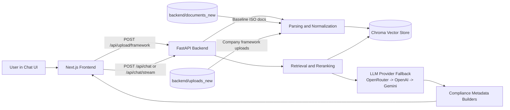
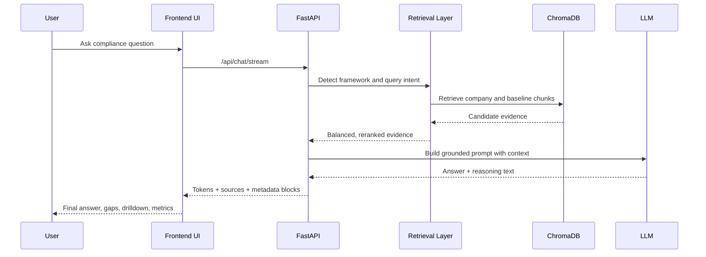
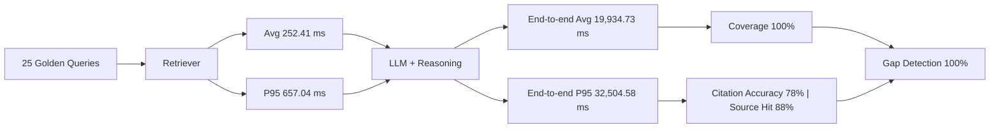
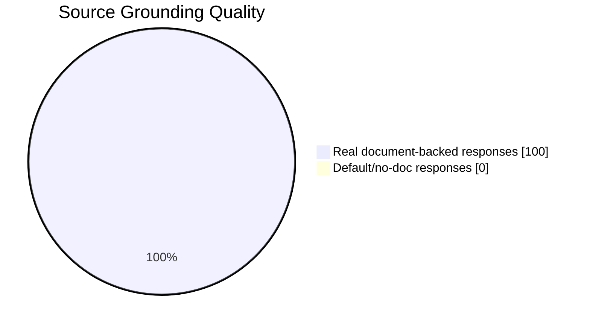

# FinGuide

FinGuide is an AI-powered ISO compliance copilot that compares company policy documents against original ISO standards and produces clause-level findings, evidence traceability, and remediation actions.

## Problem This Solves

Compliance teams spend significant time manually mapping company documents to ISO requirements. This project reduces that effort by providing:
- side-by-side company vs ISO comparison,
- gap-focused findings with citations,
- structured action plans for remediation.

## Use Case Description

### Background
Forensic and Financial Crime teams often run compliance assessments manually using scattered policies, spreadsheets, and document checklists. This makes ISO readiness reviews slow and difficult to scale.

### Core Problem
Organizations need quick, reliable answers to questions like:
- "How compliant are we with ISO 37001 anti-bribery requirements?"
- "Which clauses are weak or missing evidence?"
- "What should be fixed first?"

Today, this is usually done with manual clause mapping and subjective scoring, which leads to delays and inconsistent outcomes.

### What This System Does
FinGuide converts ISO standards into an interactive AI workflow that can:
- ingest company policy/framework documents,
- compare them against ISO baseline text,
- generate clause-level readiness scoring,
- identify gaps with evidence-backed citations,
- propose prioritized remediation actions.

### Business Outcome
This turns manual checklist reviews into a scalable, self-service compliance assessment flow. Teams get faster decision support, better traceability, and clearer remediation planning.

## Scope

Current frameworks supported:
- ISO 37001 (Anti-bribery Management)
- ISO 37301 (Compliance Management)
- ISO 37000 (Governance of Organizations)
- ISO 37002 (Whistleblowing Management)

## Architecture Diagram



## Processing Workflow



## Key Features

- 4 framework upload slots (one company file per framework)
- Baseline ISO documents preloaded from backend knowledge base
- Clause-level gap analysis with grounded sources
- Evidence trace panel with strength labels
- Clause drill-down (company snippet vs baseline snippet)
- Contradiction detection and freshness tracking
- 30/60/90 remediation plan
- Strict insufficient-evidence behavior (no hallucinated claims)
- Streaming responses and metadata-rich frontend rendering

## Evaluation Metrics (Latest Run)

Snapshot date: `2026-03-09`

Run command:

```bash
cd backend
python tools/rag_eval.py --queries tools/golden_compliance_eval_set.json --out tools/rag_eval_report_latest.json
```

Metrics summary (golden set):

| Metric | Value |
|---|---:|
| Queries | 25 |
| Documents indexed | 940 |
| Avg total latency | 19,934.73 ms |
| Median total latency | 19,950.38 ms |
| P95 total latency | 32,504.58 ms |
| Avg retrieval latency | 252.41 ms |
| P95 retrieval latency | 657.04 ms |
| Avg retrieved docs/query | 10.00 |
| Avg cited sources/answer | 8.52 |
| Coverage rate (real doc-backed answers) | 100.0% |
| Default source rate | 0.0% |
| Unique sources cited | 104 |
| Precision@k | 0.052 |
| Clause recall | 0.320 |
| Citation accuracy | 0.780 |
| Gap detection accuracy | 1.000 |
| Clause hit query rate | 0.400 |
| Source hit query rate | 0.880 |
| Strict citation match rate | 0.680 |
| Avg unique retrieved doc sources/query | 3.48 |
| Avg source diversity ratio | 0.348 |
| Avg evidence balance score (company vs baseline) | 0.309 |
| Clause grounding valid rate | 0.720 |
| Missing section presence rate | 0.960 |
| Improve section presence rate | 0.960 |
| Missing details presence rate | 1.000 |
| Improvement suggestions presence rate | 1.000 |
| Strict no-evidence mode rate | 1.000 |

### Easy Stats (For Non-Technical Users)

This is the same data in plain words:

| Easy Metric | Current Value | What It Means |
|---|---:|---|
| Average answer time | 19.93 seconds | A normal response takes about 20 seconds end-to-end. |
| Typical answer time | 19.95 seconds | Most responses are around 20 seconds. |
| Slow-case answer time (P95) | 32.50 seconds | 95% of answers finish within about 33 seconds. |
| Retrieval speed (average) | 0.25 seconds | Finding relevant chunks in the vector DB is still fast. |
| Retrieval speed (P95) | 0.66 seconds | Even in slower cases, evidence lookup is under 1 second. |
| Real document grounding | 100% | Every evaluated answer used real indexed documents. |
| Default/no-document answers | 0% | The system did not fall back to generic no-doc responses in this run. |
| Evidence breadth | 8.52 sources/answer | Each answer uses around 8 to 9 cited sources. |
| Citation quality | 78% | Most citations matched expected benchmark sources. |
| Gap finding reliability | 100% | When a test expected a gap signal, the model detected it. |
| Clause coverage quality | 32% recall | Clause-level coverage is improving but still a key optimization area. |
| Query-level clause hit | 40% | In 40% of benchmark queries, at least one expected clause was retrieved. |
| Query-level source hit | 88% | In most queries, at least one expected source was correctly cited. |
| Full source match | 68% | Around two-thirds of queries cited all expected sources. |
| Evidence balance | 0.309 / 1.0 | Company-vs-ISO evidence balance needs improvement for stronger comparisons. |
| Clause grounding validity | 72% | Most clause references are grounded, but more validation improvement is needed. |

Quick read:
- Strong: grounding coverage, source hit rate, and gap detection.
- Improving: clause recall, full citation match rate, and company-vs-ISO evidence balance.

### Quick Visual Summary





Detailed report JSON: `backend/tools/rag_eval_report_latest.json`

## How Data Is Organized

- `backend/documents_new/`: baseline ISO documents (knowledge base)
- `backend/uploads_new/<framework>/`: uploaded company docs per framework slot
- `backend/chroma_db_new/`: local vector index generated at runtime

Important UI note:
- The `ISO Framework Uploads` panel lists company uploads only.
- Baseline ISO files are loaded from knowledge base and are not listed in that upload panel.

## Repository Structure

- `frontend/`: Next.js app and chat UX
- `backend/main.py`: API endpoints and response schemas
- `backend/bot.py`: RAG retrieval, balancing, metadata generation, compliance logic
- `backend/tools/`: evaluation scripts and reports

## Local Setup

### Backend

```bash
cd backend
pip install -r requirements.txt
python run.py
```

Backend URL: `http://127.0.0.1:8000`

### Frontend

```bash
cd frontend
pnpm install
pnpm run mvp
```

Frontend URL: `http://localhost:3100`

### Frontend Environment

Create `frontend/.env.local`:

```env
NEXT_PUBLIC_API_URL=http://localhost:8000
```

## API Endpoints

- `POST /api/upload/framework`: upload company document into one framework slot
- `POST /api/chat/stream`: streaming response with token/source/meta events
- `POST /api/chat`: non-stream response
- `GET /api/status`: backend health and index status
- `DELETE /api/documents/{id}`: remove uploaded document

## Behavior Guarantees

- Compliance answers are context-grounded.
- Retrieval enforces balanced company + baseline evidence for broad ISO queries.
- If evidence is insufficient, the system explicitly says so instead of guessing.

## Contributors Notes

- Keep product name exactly `FinGuide`.
- Do not commit runtime indexes/uploads or proprietary documents.
- Prioritize explainability: citations, clause grounding, and actionable remediation.

## License

MIT (or repository license file).
